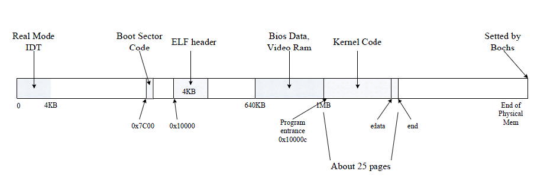

# lab2 - Exercise

#### 【2020-04-01】 

建立分支，准备环境，

#### 【2020-04-07】

学习`pmap.c`、`memlayout.h`、`pmap.h`，~~根据自己的理解做了详细注释~~

### 练习前梳理

引用一张图，图像化展示内存布局(复习一下lab1)：



对比lab1给的布局(做了一下补充)：

```shell

+------------------+  <- 0xFFFFFFFF (4GB)
|      32-bit      |
|  memory mapped   |
|     devices      |
|                  |
/\/\/\/\/\/\/\/\/\/\

/\/\/\/\/\/\/\/\/\/\
|                  |
|      Unused      |
|                  |
+------------------+  <- depends on amount of RAM
|                  |
|                  |
| Extended Memory  |
|                  |
|                  |
+------------------+  <- 0x00100000 (1MB) // kern code
|     BIOS ROM     |
+------------------+  <- 0x000F0000 (960KB)
|  16-bit devices, |
|  expansion ROMs  |
+------------------+  <- 0x000C0000 (768KB)
|   VGA Display    |
+------------------+  <- 0x000A0000 (640KB)
|                  |
|    Low Memory    |  <- 0x10000 (ELF header)
|                  |
+------------------+  <- 0x00000000

```

在进行实验之前，我们通过`boot.S`的`call bootmain`转移到了`bootmain(boot/main.c)`的`((void (*)(void)) (ELFHDR->e_entry))();`然后进入内核`entry.S`的`call i386_init`来到了目前的练习。

在`entry.S`之前，首先，内核使分页能够使用虚拟内存并解决位置依赖性。 用`kern/entrypgdir.c`中的实现映射，静态初始化的页面目录和页面表。 仅映射物理内存的前4M。这样，`entry.S`可以在高地址操作。即：

```c
// Map VA's [0, 4MB) to PA's [0, 4MB)
// Map VA's [KERNBASE, KERNBASE+4MB) to PA's [0, 4MB)
```

- virtual addresses `0xf0000000` through `0xf0400000` to physical addresses` 0x00000000` through `0x00400000`
- virtual addresses `0x00000000` through `0x00400000` to physical addresses `0x00000000` through `0x00400000`

`Init.c`的预操作：

```c
// kern/init.c
void
i386_init(void)
{
	extern char edata[], end[];

	// Before doing anything else, complete the ELF loading process.
	// Clear the uninitialized global data (BSS) section of our program.
	// This ensures that all static/global variables start out zero.
	memset(edata, 0, end - edata);

	// Initialize the console.
	// Can't call cprintf until after we do this!
	cons_init();

	cprintf("6828 decimal is %o octal!\n", 6828);

	// Lab 2 memory management initialization functions
	mem_init();

	// Drop into the kernel monitor.
	while (1)
		monitor(NULL);
}
```

这里初始化了`bss`段，众所周知不初始化的全局变量在`bss`里声明，并置为`0`。

**到目前为止，我们仅使用`entry_pgdir`和`entry_pgtable`手动映射了`KERNBASE`开始的4M内存。** 

### Ecercise 1

调用`mem_init();`来到需要我们完善的地方`pmap.c`

这里只设置内核部分，即`addresses >= UTOP`。

首先确定有多少可用内存，更新`npages`，`npages_basemem`。然后使用一个页面来作为页面目录`page directory`，来到`boot_alloc()`。

```c
// nextfree是空闲内存下一个字节的虚拟地址，被初始化到.bss的end。
[...]
if(n > 0) {
  result = nextfree;
  nextfree = ROUNDUP((char*)(nextfree + n), PGSIZE);
  if((uint32_t)nextfree - KERNBASE > (npages * PGSIZE))	//检测是否超出分配范围。
    panic("Out Of Memory!\n");
  return result;
}
else if(n == 0)
  return nextfree;
return NULL;
[···]
```

然后（先跳过在虚拟地址UVPT处形成虚拟页表部分），分配`npages`个`struct PageInfo`元素组成数组，并将其存储在`pages`中。内核使用此数组来跟踪物理页面。

```c
struct PageInfo {
	// Next page on the free list.
	struct PageInfo *pp_link;

	// pp_ref is the count of pointers (usually in page table entries)
	// to this page, for pages allocated using page_alloc.
	// Pages allocated at boot time using pmap.c's
	// boot_alloc do not have valid reference count fields.

	uint16_t pp_ref;
};	//memlayout.h
pages = (struct PageInfo *) boot_alloc(npages * sizeof(struct PageInfo));
memset(pages, 0, npages * sizeof(struct PageInfo));
```

随后需要进入并完成`page_init()`函数：

根据要求把这几项提示完成即可：

```c
	size_t i;
	page_free_list = NULL;

	// 已分配使用部分(extmem)
	int num_alloc = ((uint32_t)boot_alloc(0) - KERNBASE) / PGSIZE;
	//IO部分 384K
	int num_IOhole = (EXTPHYSMEM - IOPHYSMEM) / PGSIZE;

	// page 0
	pages[0].pp_ref = 1;
	// last base memory 
	for(i = 1; i < npages_basemem; i++)
	{
		pages[i].pp_ref = 0;
		pages[i].pp_link = page_free_list;
		page_free_list = &pages[i];
	}
	// alloc / IO hole 
	for(i = npages_basemem; i < npages_basemem + num_IOhole + num_alloc; i++)
  	pages[i].pp_ref = 1;
	// last
	for(; i < npages; i++)
	{
		pages[i].pp_ref = 0;
		pages[i].pp_link = page_free_list;
		page_free_list = &pages[i];
	}
```

此时，`page_free_list`链表指向地址最高的`free page`

最后进入`check_page_free_list()`函数来测试。~~参数`1`指定了包含`entry_pgdir`的`Page Dictionary`。~~

然后是`page_alloc()`、`page_free()`

```c
struct PageInfo *
page_alloc(int alloc_flags)
{
	// Fill this function in
	if(!page_free_list)
		return NULL;
	struct PageInfo *pp = page_free_list;
	if(alloc_flags & ALLOC_ZERO) {
		memset(page2kva(pp), 0, PGSIZE);
	}
	page_free_list = pp->pp_link;
	pp->pp_link = NULL;
	return pp;	
}

void
page_free(struct PageInfo *pp)
{
	// Fill this function in
	// Hint: You may want to panic if pp->pp_ref is nonzero or
	// pp->pp_link is not NULL.
	if(pp->pp_ref != 0)
		panic("pp->pp_ref is nonzero\n");
	if(pp->pp_link)
		panic("pp->pp_link is not NULL\n");

	pp->pp_link = page_free_list;
	page_free_list = pp;
}
```


