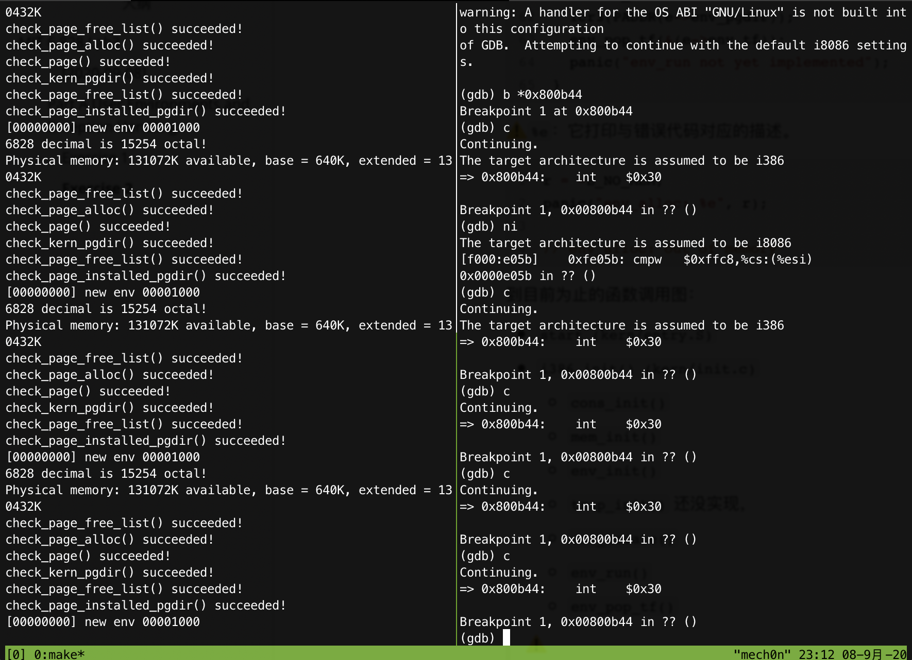

# MIT 6.828 Lab3

#### [2020-09-08] 

- 开新坑

Lab3多出来的文件

| `inc/`  | `env.h`       | Public definitions for user-mode environments                |
| ------- | ------------- | ------------------------------------------------------------ |
|         | `trap.h`      | Public definitions for trap handling                         |
|         | `syscall.h`   | Public definitions for system calls from user environments to the kernel |
|         | `lib.h`       | Public definitions for the user-mode support library         |
| `kern/` | `env.h`       | Kernel-private definitions for user-mode environments        |
|         | `env.c`       | Kernel code implementing user-mode environments              |
|         | `trap.h`      | Kernel-private trap handling definitions                     |
|         | `trap.c`      | Trap handling code                                           |
|         | `trapentry.S` | Assembly-language trap handler entry-points                  |
|         | `syscall.h`   | Kernel-private definitions for system call handling          |
|         | `syscall.c`   | System call implementation code                              |
| `lib/`  | `Makefrag`    | Makefile fragment to build user-mode library, `obj/lib/libjos.a` |
|         | `entry.S`     | Assembly-language entry-point for user environments          |
|         | `libmain.c`   | User-mode library setup code called from `entry.S`           |
|         | `syscall.c`   | User-mode system call stub functions                         |
|         | `console.c`   | User-mode implementations of `putchar` and `getchar`, providing console I/O |
|         | `exit.c`      | User-mode implementation of `exit`                           |
|         | `panic.c`     | User-mode implementation of `panic`                          |
| `user/` | `*`           | Various test programs to check kernel lab 3 code             |


### Part A User Environments and Exception Handling

新的包含文件`inc / env.h`包含JOS中用户环境的基本定义。 立即阅读。 内核使用`Env`数据结构来跟踪每个用户环境。 在本实验中，您最初将仅创建一个环境，但是您将需要设计JOS内核以支持多个环境。 实验4将通过允许用户环境派生其他环境来利用此功能。


在`kern / env.c`中，内核维护了与环境有关的三个主要全局变量：

```c
struct Env *envs = NULL;		// All environments
struct Env *curenv = NULL;		// The current env
static struct Env *env_free_list;	// Free environment list
```

```c
// An environment ID 'envid_t' has three parts:
//
// +1+---------------21-----------------+--------10--------+
// |0|          Uniqueifier             |   Environment    |
// | |                                  |      Index       |
// +------------------------------------+------------------+
//                                       \--- ENVX(eid) --/
//
// The environment index ENVX(eid) equals the environment's index in the
// 'envs[]' array.  The uniqueifier distinguishes environments that were
// created at different times, but share the same environment index.
//
// All real environments are greater than 0 (so the sign bit is zero).
// envid_ts less than 0 signify errors.  The envid_t == 0 is special, and
// stands for the current environment.

struct Env {
	struct Trapframe env_tf;	// Saved registers
	struct Env *env_link;		// Next free Env
	envid_t env_id;			// Unique environment identifier
	envid_t env_parent_id;		// env_id of this env's parent
	enum EnvType env_type;		// Indicates special system environments
	unsigned env_status;		// Status of the environment
	uint32_t env_runs;		// Number of times environment has run

	// Address space
	pde_t *env_pgdir;		// Kernel virtual address of page dir
};
```

OS启动并运行后，`envs`指针指向代表系统中所有环境的`Env`结构数组。 在我们的设计中，尽管在任何给定时间通常运行的环境通常要少得多，但是JOS内核将最多支持`NENV`同时活动的环境。（`NENV`是在`inc / env.h`中）一旦分配完毕，`envs`数组将包含一个`Env`数据结构的`NENV`（每一个）可能的环境的实例。

JOS内核将所有非活动的`Env`结构保存在`env_free_list`列表中。这种设计允许轻松地分配和释放环境，因为它们只需要添加到空闲列表或从空闲列表中删除。

内核使用`curenv`符号在任何给定时间跟踪当前正在执行的环境。 在启动期间，在运行第一个环境之前，`curenv`最初设置为`NULL`。

**Environment State**

`Env`结构在`inc / env.h`中定义如下（将来可能会添加新的）:

```c
struct Env {
	struct Trapframe env_tf;	// Saved registers
	struct Env *env_link;		// Next free Env (用于被free掉的Env)
	envid_t env_id;			// Unique environment identifier
	envid_t env_parent_id;		// env_id of this env's parent
	enum EnvType env_type;		// Indicates special system environments(我从哪里来)
	unsigned env_status;		// Status of the environment
	uint32_t env_runs;		// Number of times environment has run

	// Address space
	pde_t *env_pgdir;		// Kernel virtual address of page dir
};
```

像Unix进程一样，JOS环境将“线程”和“地址空间”的概念结合在一起。 线程主要由保存的寄存器（`env_tf`字段）定义，地址空间由`env_pgdir`指向的页目录和页表定义。 要运行环境，内核必须使用保存的寄存器和适当的地址空间来设置CPU。在JOS中，各个环境不像xv6中的进程那样具有自己的内核堆栈。 一次在内核中只能有一个活动的JOS环境，因此JOS只需要一个内核堆栈。

**Allocating the Environments Array**

现在需要进一步修改`mem_init()`，以分配一个类似的名为`envs`的`Env`结构数组。

#### Exercise 1

>  Modify `mem_init()` in `kern/pmap.c` to allocate and map the `envs` array. This array consists of exactly `NENV` instances of the `Env` structure allocated much like how you allocated the `pages` array. Also like the `pages` array, the memory backing `envs` should also be mapped user read-only at `UENVS` (defined in `inc/memlayout.h`) so user processes can read from this array.
>
> You should run your code and make sure `check_kern_pgdir()` succeeds.

两个任务：

- 给`envs[]`分配内存：
- 然后，设置权限，并映射到`kern_pgdir`。

```c
	//////////////////////////////////////////////////////////////////////
	// Make 'envs' point to an array of size 'NENV' of 'struct Env'.
	// LAB 3: Your code here.
	envs = (struct Env *)boot_alloc(sizeof(struct Env) * NENV);
	memset(envs, 0, sizeof(struct Env) * NENV);

	//////////////////////////////////////////////////////////////////////
	// Map the 'envs' array read-only by the user at linear address UENVS
	// (ie. perm = PTE_U | PTE_P).
	// Permissions:
	//    - the new image at UENVS  -- kernel R, user R
	//    - envs itself -- kernel RW, user NONE
	// LAB 3: Your code here.
	boot_map_region(kern_pgdir, UENVS, PTSIZE, PADDR(envs), PTE_U | PTE_P);
```

```shell
➜  lab git:(lab3) ✗ make qemu-nox
check_kern_pgdir() succeeded!
```

**Creating and Running Environments **

在运行用户环境所需的`kern / env.c`中编写代码。 因为我们还没有文件系统，所以我们将设置内核以加载嵌入在内核本身中的静态二进制映像。 JOS将此二进制文件作为ELF可执行映像嵌入内核。

#### Exercise 2

>  In the file `env.c`, finish coding the following functions:
>
> - `env_init()`
>
>   Initialize all of the `Env` structures in the `envs` array and add them to the `env_free_list`. Also calls `env_init_percpu`, which configures the segmentation hardware with separate segments for privilege level 0 (kernel) and privilege level 3 (user).
>
> - `env_setup_vm()`
>
>   Allocate a page directory for a new environment and initialize the kernel portion of the new environment's address space.
>
> - `region_alloc()`
>
>   Allocates and maps physical memory for an environment
>
> - `load_icode()`
>
>   You will need to parse an ELF binary image, much like the boot loader already does, and load its contents into the user address space of a new environment.
>
> - `env_create()`
>
>   Allocate an environment with `env_alloc` and call `load_icode` to load an ELF binary into it.
>
> - `env_run()`
>
>   Start a given environment running in user mode.
>
> As you write these functions, you might find the new cprintf verb `%e` useful -- it prints a description corresponding to an error code. For example,
>
> ```
> 	r = -E_NO_MEM;
> 	panic("env_alloc: %e", r);
> ```
>
> will panic with the message "env_alloc: out of memory".

>[参考]([https://jiyou.github.io/blog/2018/04/28/mit.6.828/jos-lab3/#%E4%BD%9C%E4%B8%9A2](https://jiyou.github.io/blog/2018/04/28/mit.6.828/jos-lab3))

对于那些`_binary_obj_user_hello_start`, `_binary_obj_user_hello_end`, and `_binary_obj_user_hello_size`. 的解释，可以[参考]([https://jiyou.github.io/blog/2018/04/28/mit.6.828/jos-lab3/#%E4%BD%9C%E4%B8%9A2](https://jiyou.github.io/blog/2018/04/28/mit.6.828/jos-lab3/#作业2))

`env_int()`:初始化`envs`数组中的所有`Env`结构，并将它们添加到`env_free_list`。 还调用`env_init_percpu()`，它将为特权级别0（内核）和特权级别3（用户）配置具有单独段的分段硬件。

```c
// Mark all environments in 'envs' as free, set their env_ids to 0,
// and insert them into the env_free_list.
// Make sure the environments are in the free list in the same order
// 这里需要调整这些Env链入list的顺序，确保第一次分配Env的时候返回envs[0],所以应该反着链入到链表。
// they are in the envs array (i.e., so that the first call to
// env_alloc() returns envs[0]).
//
void
env_init(void)
{
	// Set up envs array
	// LAB 3: Your code here.
	memset(envs, 0, sizeof(envs));
	env_free_list = NULL;
	for(int i = NENV - 1; i >= 0; i--)
	{
		envs[i].env_link = env_free_list;
		env_free_list = &envs[i];
		// env_free_list = envs + i;
	}
	assert(env_free_list == envs);

	// Per-CPU part of the initialization
	env_init_percpu();
}
```

`env_setup_vm()`: 为新环境分配页面目录，并初始化新环境的地址空间的内核部分。

```c
	// Now, set e->env_pgdir and initialize the page directory.
	//
	// Hint:
	//    - The VA space of all envs is identical above UTOP
	//	(except at UVPT, which we've set below).
	//	See inc/memlayout.h for permissions and layout.
	//	Can you use kern_pgdir as a template?  Hint: Yes.
	//	(Make sure you got the permissions right in Lab 2.)
	//    - The initial VA below UTOP is empty.
	//    - You do not need to make any more calls to page_alloc.
	//    - Note: In general, pp_ref is not maintained for
	//	physical pages mapped only above UTOP, but env_pgdir
	//	is an exception -- you need to increment env_pgdir's
	//	pp_ref for env_free to work correctly.
	//    - The functions in kern/pmap.h are handy.

	// LAB 3: Your code here.
	e->env_pgdir = page2kva(p);
	p->pp_ref++;
	memcpy(e->env_pgdir, kern_pgdir, PGSIZE);
	
	// UVPT maps the env's own page table read-only.
	// Permissions: kernel R, user R
	e->env_pgdir[PDX(UVPT)] = PADDR(e->env_pgdir) | PTE_P | PTE_U;
```

`region_alloc()`为环境分配和映射物理内存

```c
//
// Allocate len bytes of physical memory for environment env,
// and map it at virtual address va in the environment's address space.
// Does not zero or otherwise initialize the mapped pages in any way.
// Pages should be writable by user and kernel.
// Panic if any allocation attempt fails.
//
static void
region_alloc(struct Env *e, void *va, size_t len)
{
	// LAB 3: Your code here.
	// (But only if you need it for load_icode.)
	//
	// Hint: It is easier to use region_alloc if the caller can pass
	//   'va' and 'len' values that are not page-aligned.
	//   You should round va down, and round (va + len) up.
	//   (Watch out for corner-cases!)
  // 分配len字节的物理地址给进程env，并且要映射到虚拟地址va.
  // 考虑对齐。
	void *v = ROUNDDOWN(va, PGSIZE);
	size_t l = ROUNDUP(len, PGSIZE);
	for (uint32_t i = 0; i < l; i += PGSIZE) 
	{
		struct PageInfo *p = page_alloc(0);
		if (!p) 
      panic("region_alloc :%e", -E_NO_MEM);
		assert(!page_insert(e->env_pgdir, p, v, PTE_U | PTE_W));
		v += PGSIZE;
		assert(v > va && i < len);
	}
}
```

`load_icode()`解析一个ELF二进制映像，就像引导加载程序已经做的那样，并将其内容加载到新环境的用户地址空间中。

```c
// 设置初始程序二进制，堆栈和处理器标志用于用户进程。
// 仅在内核初始化期间调用此函数，在运行第一个用户模式环境之前。
// 此函数从ELF二进制映像加载所有可加载的段
// 从适当的位置开始进入环境的用户内存,ELF程序标头中指示的虚拟地址。
// 同时这个程序也会把应该清0的段对应的内存进行清0操作。比如程序里面的bss段。
// 除了启动之外，所有其他操作都与我们的引导加载程序非常相似
// 加载程序还需要从磁盘读取代码。 可以参考boot/main.c
// 最后会加载一页做为程序初始的栈。
// 如果遇到问题，则load_icode会出现紧急情况。

// ELF header里面记录了所有的段的信息。
// 只加载：ph->p_type = ELF_PROG_LOAD
// 任何剩余的内存字节都应该被清除为零。
// 页权限: PTE_U | PTE_W
// ELF段不需要页对齐：不会有两个段指向同样的虚拟地址

	// LAB 3: Your code here.
	struct Elf *ELFHDR = (struct Elf*)binary;
	assert(ELFHDR->e_magic == ELF_MAGIC);
	struct Proghdr *ph, *eph;

	ph = (struct Proghdr *) ((uint8_t *) ELFHDR + ELFHDR->e_phoff);
	eph = ph + ELFHDR->e_phnum;
	lcr3(PADDR(e->env_pgdir));
	for (; ph < eph; ph++) 
	{
		if (ph->p_type == ELF_PROG_LOAD)
		{
			region_alloc(e, (void*)(ph->p_va), ph->p_memsz);
			uint8_t *src = binary + ph->p_offset;
			uint8_t *dst = (uint8_t*)ph->p_va;
			// 页面可能不是连续
			memcpy(dst, src, ph->p_filesz);
			if (ph->p_filesz < ph->p_memsz)
				memset(dst + ph->p_filesz, 0, ph->p_memsz - ph->p_filesz);
		}
	}
	lcr3(PADDR(kern_pgdir));
	e->env_tf.tf_eip = ELFHDR->e_entry;
	// Now map one page for the program's initial stack
	// at virtual address USTACKTOP - PGSIZE.

	// LAB 3: Your code here.
	// 分配一个页面做为程序的栈
	region_alloc(e, (void*)(USTACKTOP - PGSIZE), PGSIZE);
```

`env_create()`使用`env_alloc`分配环境，然后调用`load_icode`将ELF二进制文件加载到其中。

```c
//
// Allocates a new env with env_alloc, loads the named elf
// binary into it with load_icode, and sets its env_type.
// 这个函数只在内核初始化期间调用
// This function is ONLY called during kernel initialization,
// 在运行第一个用户模式环境之前。
// before running the first user-mode environment.
// The new env's parent ID is set to 0.
// 父ID为0.
//
void
env_create(uint8_t *binary, enum EnvType type)
{
	// LAB 3: Your code here.
	struct Env *env;
	assert(!env_alloc(&env, 0));
	env->env_parent_id = 0;
	env->env_type = type;
	load_icode(env, binary);
}
```

`env_run()`启动一个以用户模式运行的给定环境。

```c
//
// Restores the register values in the Trapframe with the 'iret' instruction.
// 使用'iret'指令恢复Trapframe中的寄存器值。
// This exits the kernel and starts executing some environment's code.
// 这将退出内核并开始执行一些环境代码。
//
// This function does not return.
//
void
env_pop_tf(struct Trapframe *tf)
{
	asm volatile(
		"\tmovl %0,%%esp\n"
		"\tpopal\n"
		"\tpopl %%es\n"
		"\tpopl %%ds\n"
		"\taddl $0x8,%%esp\n" /* skip tf_trapno and tf_errcode */
		"\tiret\n"
		: : "g" (tf) : "memory");
	panic("iret failed");  /* mostly to placate the compiler */
}

//
// Context switch from curenv to env e.
// context从curenv切换到env e。
// Note: if this is the first call to env_run, curenv is NULL.
//
// This function does not return.
//
void
env_run(struct Env *e)
{
	// Step 1: If this is a context switch (a new environment is running):
	//			如果这是一个context切换(一个新的环境正在运行)
	//	   1. Set the current environment (if any) back to
	//	      ENV_RUNNABLE if it is ENV_RUNNING (think about
	//	      what other states it can be in),
	//			如果当前环境ENV_RUNNABLE，则将其设置为ENV RUNNABLE
	//	   2. Set 'curenv' to the new environment,
	// 			curenv = e;
	//	   3. Set its status to ENV_RUNNING,
	//			curenv->env_status = ENV_RUNNING
	//	   4. Update its 'env_runs' counter,
	//			e->env_runs++
	//	   5. Use lcr3() to switch to its address space.
	//			lcr3()改变页面目录，使用程序的地址空间。
	// Step 2: Use env_pop_tf() to restore the environment's
	//	   registers and drop into user mode in the
	//	   environment.

	// Hint: This function loads the new environment's state from
	//	e->env_tf.  Go back through the code you wrote above
	//	and make sure you have set the relevant parts of
	//	e->env_tf to sensible values.

	// LAB 3: Your code here.
	if (curenv && curenv->env_status == ENV_RUNNING)
		 curenv->env_status = ENV_RUNNABLE;
	curenv = e;
	curenv->env_status = ENV_RUNNING;
	e->env_runs++;
	lcr3(PADDR(e->env_pgdir));
	env_pop_tf(&(e->env_tf));
	panic("env_run not yet implemented");
}
```

⚠️`%e`：它打印与错误代码对应的描述。

```c
r = -E_NO_MEM;
panic("env_alloc: %e", r);

//"env_alloc: out of memory"
```

到目前为止的函数调用图：

- `start (kern/entry.S)`
- `i386_init() (kern/init.c)`
  - `cons_init()`
  - `mem_init()`
  - `env_init()`
  - `trap_init()` 还没实现，
  - `env_create()`
  - `env_run()`
  - `env_pop_tf()`

> ⚠️
>
> 完成后，如果编译内核并在QEMU下运行它(`make qemu-nox`)。 如果一切顺利，您的系统应进入用户空间并执行hello二进制文件，直到使用int指令进行系统调用为止。 但是，因为JOS尚未设置硬件以允许从用户空间到内核的任何类型的转换。 当CPU发现未设置为处理该系统调用中断时，它将生成一个常规保护异常，发现它不能处理该异常，生成一个双重故障异常，发现它也不能处理该异常， 最后放弃所谓的“三重故障Triple fault”。 然后会看到CPU复位和系统重新启动。 尽管这对遗留应用程序很重要，但这对于内核开发是一件痛苦的事，因此，使用6.828修补的QEMU，您将看到寄存器转储和“三重错误Triple fault”信息。

崩溃重启实例：(断点断在`obj/user/hello.asm`)



```assembly
void
sys_cputs(const char *s, size_t len)
{
[···]
	800b44:	cd 30                	int    $0x30
syscall(SYS_cputs, 0, (uint32_t)s, len, 0, 0, 0);
[···]
}
```

**Handling Interrupts and Exceptions**

在这一点上，用户空间中的第一个`int $ 0x30`系统调用指令是一个死胡同：一旦处理器进入用户模式，就无法退出。 现在，您将需要实现基本的异常和系统调用处理，以便内核有可能从用户模式代码中恢复对处理器的控制。 您应该做的第一件事是完全熟悉x86中断和异常机制。

#### Exercise 3

>  Read [Chapter 9, Exceptions and Interrupts](https://pdos.csail.mit.edu/6.828/2018/readings/i386/c09.htm) in the [80386 Programmer's Manual](https://pdos.csail.mit.edu/6.828/2018/readings/i386/toc.htm) (or Chapter 5 of the [IA-32 Developer's Manual](https://pdos.csail.mit.edu/6.828/2018/readings/ia32/IA32-3A.pdf)), if you haven't already.

[关于中断相关知识]([https://jiyou.github.io/blog/2018/04/28/mit.6.828/jos-lab3/#%E4%B8%AD%E6%96%AD%E5%8F%B7%E7%9A%84%E6%8F%8F%E8%BF%B0](https://jiyou.github.io/blog/2018/04/28/mit.6.828/jos-lab3/#中断号的描述))

[【译】x86程序员手册31- 第9章 异常和中断](https://www.cnblogs.com/mqmelon/p/6693491.html)

> 中断可分为如下几种：
>
> **硬件中断（Hardware Interrupt）：**[[1\]](https://zh.wikipedia.org/wiki/中斷#cite_note-1)
>
> - *可屏蔽中断*（maskable interrupt）。硬件中断的一类，可通过在中断屏蔽寄存器中设定位掩码来关闭。
> - *非可屏蔽中断*（non-maskable interrupt，NMI）。硬件中断的一类，无法通过在中断屏蔽寄存器中设定位掩码来关闭。典型例子是时钟中断（一个硬件时钟以恒定频率—如50Hz—发出的中断）。
> - *处理器间中断*（interprocessor interrupt）。一种特殊的硬件中断。由处理器发出，被其它处理器接收。仅见于多处理器系统，以便于处理器间通信或同步。
> - *伪中断*（spurious interrupt）。一类不希望被产生的硬件中断。发生的原因有很多种，如中断线路上电气信号异常，或是中断请求设备本身有问题。
>
> **软件中断（Software Interrupt）：**[[2\]](https://zh.wikipedia.org/wiki/中斷#cite_note-2)
>
> - *软件中断*。是一条CPU指令，用以自陷一个中断。由于软中断指令通常要运行一个切换CPU至[内核态](https://zh.wikipedia.org/w/index.php?title=内核态&action=edit&redlink=1)（Kernel Mode/Ring 0）的子例程，它常被用作实现[系统调用](https://zh.wikipedia.org/wiki/系统调用)（System call）。
>
> 处理器通常含有一个内部中断屏蔽位，并允许通过软件来设定。一旦被设定，所有外部中断都将被系统忽略。这个屏蔽位的访问速度显然快于中断控制器上的中断屏蔽寄存器，因此可提供更快速地中断屏蔽控制。
>
> 
>
> 如果一个中断使得机器处于一种确定状态，则称为精确中断（precise interrupt）。精确中断须保证：
>
> - 程序计数器的值被保存在已知位置。
> - 程序计数器所指向的指令之前的所有指令已被执行完毕。
> - 程序计数器所指向的指令之后的所有指令不可被执行。如果中断信号到来后而转入处理前发生了任何针对寄存器／内存的更改，都必须予以还原。
> - 程序计数器所指向的指令地执行状态已知。
>
> 倘无法满足以上条件，此中断被称作非精确中断（imprecise interrupt）。

> 一些与中断控制相关的指令包括：
>
> - `CLI` 关闭中断（实为将FLAGS的IF位置0）。
> - `STI` 开启中断（实为将FLAGS的IF位置1）。
> - `INT n` 调用中断子程序，n为中断类型码。[DOS](https://zh.wikipedia.org/wiki/DOS)系统有一个系统调用API即为INT 21H。
> - `INT0` 先判别FLAGS的OF位是否为1，如是则直接调用类型为4的中断子程序，用以处理溢出中断。
> - `IRET` 将栈顶6个字节分别弹出并存入IP、CS和FLAGS寄存器，用以返回中断现场。

> Table 9-2. Priority Among Simultaneous Interrupts and Exceptions
>
> Priority   Class of Interrupt or Exception
>
> HIGHEST    Faults except debug faults
> Trap instructions INTO, INT n, INT 3
> Debug traps for this instruction
> Debug faults for next instruction
> NMI interrupt
> LOWEST     INTR interrupt


当x86处理器执行中断或陷阱导致特权级别从用户模式更改为内核模式时，它还会切换到内核内存中的堆栈。 称为任务状态段（TSS）的结构指定了段选择器和该堆栈所在的地址。 处理器（在此新堆栈上）推送SS，ESP，EFLAGS，CS，EIP和可选的错误代码。 然后，它从中断描述符中加载CS和EIP，并将ESP和SS设置为引用新堆栈。

尽管TSS很大，并且可能有多种用途，但JOS仅使用它来定义处理器从用户模式转换到内核模式时应切换到的内核堆栈。 由于JOS中的“内核模式”在x86上的特权级别为0，因此处理器在进入内核模式时使用TSS的ESP0和SS0字段来定义内核堆栈。 JOS不使用任何其他TSS字段。

x86处理器可以在内部生成的所有同步异常都使用0到31之间的中断向量，因此映射到IDT条目0-31。 例如，页面错误总是通过向量14引起异常。大于31的中断向量仅由软件中断使用，该中断可以由int指令生成，也可以由外部设备在需要注意时引起的异步硬件中断生成。

在本节中，我们将扩展JOS来处理矢量0-31中内部生成的x86异常。 在下一节中，我们将使JOS处理软件中断向量48（0x30），JOS（相当随意）将其用作系统调用中断向量。 在实验4中，我们将扩展JOS以处理外部生成的硬件中断，例如时钟中断。

**An Example**

假设处理器正在用户环境中执行代码，并遇到试图除以零的除法指令。

1. 处理器切换到由TSS的SS0和ESP0字段定义的堆栈，该堆栈在JOS中将分别保存值`GD_KD`和`KSTACKTOP`。

2. 处理器将异常参数从地址`KSTACKTOP`开始推入内核堆栈：

   ```c
                        +--------------------+ KSTACKTOP             
                        | 0x00000 | old SS   |     " - 4
                        |      old ESP       |     " - 8
                        |     old EFLAGS     |     " - 12
                        | 0x00000 | old CS   |     " - 16
                        |      old EIP       |     " - 20 <---- ESP 
                        +--------------------+             
   ```

3. 因为我们正在处理除法错误，即x86上的中断向量0，所以处理器读取IDT条目0并将CS：EIP设置为指向该条目描述的处理函数。

4. 处理程序函数控制并处理异常，例如通过终止用户环境。

对于某些类型的x86异常，除了上面的“标准”五个字以外，处理器还将包含错误代码的另一个字压入堆栈。 重要的示例是14号页面错误异常。 请参阅80386手册，以确定处理器将哪个错误号推送到错误代码，以及在这种情况下错误代码的含义。 当处理器推送错误代码时，从用户模式进入时，堆栈在异常处理程序的开头看起来如下：

-                      +--------------------+ KSTACKTOP             
                       | 0x00000 | old SS   |     " - 4
                       |      old ESP       |     " - 8
                       |     old EFLAGS     |     " - 12
                       | 0x00000 | old CS   |     " - 16
                       |      old EIP       |     " - 20
                       |     error code     |     " - 24 <---- ESP
                       +--------------------+     

**Nested Exceptions and Interrupts**

处理器可以接受来自内核和用户模式的异常和中断。 但是，只有从用户模式进入内核时，x86处理器才会自动切换堆栈，然后再将其旧的寄存器状态推入堆栈并通过IDT调用适当的异常处理程序。 如果在发生中断或异常时处理器已经处于内核模式（CS寄存器的低2位已经为零），则CPU会将更多的值压入同一内核堆栈。 这样，内核可以优雅地处理由内核本身内的代码引起的嵌套异常。 该功能是实现保护的重要工具，我们将在后面的系统调用部分中看到。

如果处理器已经处于内核模式并采用嵌套异常，则由于它不需要切换堆栈，因此不会保存旧的SS或ESP寄存器。 因此，对于不推送错误代码的异常类型，内核堆栈在进入异常处理程序时如下所示：

- ```c
                       +--------------------+ <---- old ESP
                       |     old EFLAGS     |     " - 4
                       | 0x00000 | old CS   |     " - 8
                       |      old EIP       |     " - 12
                       +--------------------+   
  ```

对于推送错误代码的异常类型，处理器会像以前一样在旧EIP之后立即推送错误代码。

处理器的嵌套异常功能有一个重要警告。 如果处理器已经处于内核模式时发生异常，并且由于缺少堆栈空间等任何原因而无法将其旧状态推送到内核堆栈，则处理器无法采取任何措施来恢复，因此只需重置自身即可。 不用说，应该对内核进行设计，以免发生这种情况。

**Setting Up the IDT**

将设置IDT以处理中断向量0-31（处理器异常）。 在本实验的后面，我们将处理系统调用中断，并在以后的实验中添加中断32-47（设备IRQ）。

头文件`inc/trap.h`和`kern/trap.h`包含与中断和异常相关的重要定义，

文件`kern/trap.h`包含对内核严格私有的定义，而`inc/trap.h`包含对用户级程序和库也可能有用的定义。

⚠️:0-31范围内的一些异常是由Intel定义为保留的。由于它们永远不会由处理器生成，因此如何处理它们实际上并不重要。

实现的总体控制流程如下所示：

```c
      IDT                   trapentry.S         trap.c
   
+----------------+                        
|   &handler1    |---------> handler1:          trap (struct Trapframe *tf)
|                |             // do stuff      {
|                |             call trap          // handle the exception/interrupt
|                |             // ...           }
+----------------+
|   &handler2    |--------> handler2:
|                |            // do stuff
|                |            call trap
|                |            // ...
+----------------+
       .
       .
       .
+----------------+
|   &handlerX    |--------> handlerX:
|                |             // do stuff
|                |             call trap
|                |             // ...
+----------------+
```

每个异常或中断都应该在 `trapentry.S` 中有它自己的处理程序，并且 `trap_init()` 应该使用这些处理程序的地址去初始化 IDT。每个处理程序都应该在栈上构建一个 `struct Trapframe`（查看 `inc/trap.h`），然后使用一个指针调用 `trap()`（在 `trap.c` 中）到 `Trapframe`。`trap()` 接着处理异常/中断或派发给一个特定的处理函数。

#### Exercise 4

> Edit `trapentry.S` and `trap.c` and implement the features described above. The macros `TRAPHANDLER` and `TRAPHANDLER_NOEC` in `trapentry.S` should help you, as well as the T_* defines in `inc/trap.h`. You will need to add an entry point in `trapentry.S` (using those macros) for each trap defined in `inc/trap.h`, and you'll have to provide `_alltraps` which the `TRAPHANDLER` macros refer to. You will also need to modify `trap_init()` to initialize the `idt` to point to each of these entry points defined in `trapentry.S`; the `SETGATE` macro will be helpful here.
>
> Your `_alltraps` should:
>
> 1. push values to make the stack look like a struct Trapframe
> 2. load `GD_KD` into `%ds` and `%es`
> 3. `pushl %esp` to pass a pointer to the Trapframe as an argument to trap()
> 4. `call trap` (can `trap` ever return?)
>
> Consider using the `pushal` instruction; it fits nicely with the layout of the `struct Trapframe`.
>
> Test your trap handling code using some of the test programs in the `user` directory that cause exceptions before making any system calls, such as `user/divzero`. You should be able to get make grade to succeed on the `divzero`, `softint`, and `badsegment` tests at this point.

`TRAPHANDLER` 定义了一个全局可见的函数来处理陷阱。它将一个陷阱号`push`到堆栈上，然后跳转到`alltraps`。将`TRAPHANDLER`用于陷阱，CPU会在该陷阱中自动推送错误代码。

```assembly
#define TRAPHANDLER(name, num)						\
	.globl name;		/* define global symbol for 'name' */	\
	.type name, @function;	/* symbol type is function */		\
	.align 2;		/* align function definition */		\
	name:			/* function starts here */		\
	pushl $(num);							\
	jmp _alltraps
```

`TRAPHANDLER_NOEC`用于陷阱，即CPU不会推送错误代码的陷阱。它将0代替错误代码，因此陷阱帧具有相同的格式。

至于是否是否使用错误代码[参考](https://pdos.csail.mit.edu/6.828/2016/readings/i386/s09_10.htm):

```
9.10 Error Code Summary
Table 9-7 summarizes the error information that is available with each exception.
Table 9-7. Error-Code Summary

Description                       Interrupt     Error Code
Number

Divide error                       0            No
Debug exceptions                   1            No
Breakpoint                         3            No
Overflow                           4            No
Bounds check                       5            No
Invalid opcode                     6            No
Coprocessor not available          7            No
System error                       8            Yes (always 0)
Coprocessor Segment Overrun        9            No
Invalid TSS                       10            Yes
Segment not present               11            Yes
Stack exception                   12            Yes
General protection fault          13            Yes
Page fault                        14            Yes
Coprocessor error                 16            No
Two-byte SW interrupt             0-255         No
```

所以:

```assembly
/*
 * Lab 3: Your code here for generating entry points for the different traps.
 */

TRAPHANDLER_NOEC( ENTRY_DIVIDE  , T_DIVIDE )  /*  0 divide error*/
TRAPHANDLER_NOEC( ENTRY_DEBUG   , T_DEBUG  )  /*  1 debug exception*/
TRAPHANDLER_NOEC( ENTRY_NMI     , T_NMI    )  /*  2 non-maskable interrupt*/
TRAPHANDLER_NOEC( ENTRY_BRKPT   , T_BRKPT  )  /*  3 breakpoint*/
TRAPHANDLER_NOEC( ENTRY_OFLOW   , T_OFLOW  )  /*  4 overflow*/
TRAPHANDLER_NOEC( ENTRY_BOUND   , T_BOUND  )  /*  5 bounds check*/
TRAPHANDLER_NOEC( ENTRY_ILLOP   , T_ILLOP  )  /*  6 illegal opcode*/
TRAPHANDLER_NOEC( ENTRY_DEVICE  , T_DEVICE )  /*  7 device not available*/
TRAPHANDLER     ( ENTRY_DBLFLT  , T_DBLFLT )  /*  8 double fault*/
/*TRAPHANDLER_NOEC( ENTRY_COPROC  , T_COPROC )*/  /*  9 reserved (not generated by recent processors)*/
TRAPHANDLER     ( ENTRY_TSS     , T_TSS    )  /* 10 invalid task switch segment*/
TRAPHANDLER     ( ENTRY_SEGNP   , T_SEGNP  )  /* 11 segment not present*/
TRAPHANDLER     ( ENTRY_STACK   , T_STACK  )  /* 12 stack exception*/
TRAPHANDLER     ( ENTRY_GPFLT   , T_GPFLT  )  /* 13 general protection fault*/
TRAPHANDLER     ( ENTRY_PGFLT   , T_PGFLT  )  /* 14 page fault*/
/*TRAPHANDLER_NOEC( ENTRY_RES     , T_RES    )*/  /* 15 reserved*/
TRAPHANDLER_NOEC( ENTRY_FPERR   , T_FPERR  )  /* 16 floating point error*/
TRAPHANDLER_NOEC( ENTRY_ALIGN   , T_ALIGN  )  /* 17 aligment check*/
TRAPHANDLER_NOEC( ENTRY_MCHK    , T_MCHK   )  /* 18 machine check*/
TRAPHANDLER_NOEC( ENTRY_SIMDERR , T_SIMDERR)  /* 19 SIMD floating point error*/
```

参照`inc\trap.h`填充代码：

```c
struct Trapframe {
	struct PushRegs tf_regs;
	uint16_t tf_es;
	uint16_t tf_padding1;
	uint16_t tf_ds;
	uint16_t tf_padding2;
	uint32_t tf_trapno;
	/* below here defined by x86 hardware */
	uint32_t tf_err;
	uintptr_t tf_eip;
	uint16_t tf_cs;
	uint16_t tf_padding3;
	uint32_t tf_eflags;
	/* below here only when crossing rings, such as from user to kernel */
	uintptr_t tf_esp;
	uint16_t tf_ss;
	uint16_t tf_padding4;
} __attribute__((packed));
```

`below`注释以下的不需要我们考虑去`push`,`tf_trapno`是我们刚刚用`TRAPHANDLER`模板实现的,剩下的实现如下：

> 你的`_alltraps`应该满足:
>
> 1. 按照Trapframe 的结构push值
> 2. 装载`GD_KD` 到 %ds和 %es
> 3. pushl %esp 传递一个指向 Trapframe 的指针作为 trap()的参数
> 4. call trap (can trap ever return?)

```assembly
    pushl %ds
    pushl %es
  	pushal
	  pushl %esp
    pushw $GD_KD
    popw  %ds
    pushw $GD_KD
    popw  %es
  	call trap
  	
/*movw不可行*/
```

> ```assembly
> /*参考大佬的详细解释*/
> 
> /*
>  * 注意压栈的顺序是从struct Trapframe的底部往上压
>  * 看一下前面的宏，已经压参数，压到了tf_trapno这里了。
>  * 注意：使用pusha指令
>  */
> _alltraps:
>     /*
>      * 注意这里直接用了pushl前面自动补0
>      * 如果要严格的对应
>      * - pushw $0
>      * - pushw %ds
>      * - pushw $0
>      * - pushw %es
>      */
>     pushl %ds
>     pushl %es
>     pushal
>     /*
>      * 这里是因为后面要调用trap函数
>      * 1. 
>      *   trap函数的定义是trap(struct Trapframe *tf)
>      *   这里还有一个指针
>      *   这个时候压入pushl %esp这个寄存器的内容。
>      *   也就刚好是真正的指向struct Trapframe这个object的起始地址
>      * 2. 
>      *   如果trap函数的定义是trap(struct Trapframe tfObject)
>      *   那么这个pushl %esp是没有必要压进去的
>      */
>     pushl %esp
>     /*然后指向内核数据段
>      * 硬件上中断门描述符进来的时候
>      * 已经把CPU设置成了GD_KT也就是内核代码段。
>      * 这个是硬件操作
>      */
>     movw $GD_KD, %ax
>     movw %ax, %ds
>     movw %ax, %es
>     call trap
>     /* 操作完成之后，
>      * 没有必要要按照反方向的顺序返回
>      * 因为trap函数最终会走到env_pop_tf()这个函数
>      * movl $tf, %esp
>      * popal
>      * popl %es
>      * popl %ds
>      * addl $0x08, %esp
>      * iret
>      */
> ```

还没完，需要在`trap_init`的时候,把这些中断描述符填上去。

先声明汇编里的函数名：

```c
extern void ENTRY_DIVIDE ();/*  0 divide error*/
extern void ENTRY_DEBUG  ();/*  1 debug exception*/
extern void ENTRY_NMI    ();/*  2 non-maskable interrupt*/
extern void ENTRY_BRKPT  ();/*  3 breakpoint*/
extern void ENTRY_OFLOW  ();/*  4 overflow*/
extern void ENTRY_BOUND  ();/*  5 bounds check*/
extern void ENTRY_ILLOP  ();/*  6 illegal opcode*/
extern void ENTRY_DEVICE ();/*  7 device not available*/
extern void ENTRY_DBLFLT ();/*  8 double fault*/
//extern void ENTRY_COPROC ();/*  9 reserved (not generated by recent processors)*/
extern void ENTRY_TSS    ();/* 10 invalid task switch segment*/
extern void ENTRY_SEGNP  ();/* 11 segment not present*/
extern void ENTRY_STACK  ();/* 12 stack exception*/
extern void ENTRY_GPFLT  ();/* 13 general protection fault*/
extern void ENTRY_PGFLT  ();/* 14 page fault*/
//extern void ENTRY_RES    ();/* 15 reserved*/
extern void ENTRY_FPERR  ();/* 16 floating point error*/
extern void ENTRY_ALIGN  ();/* 17 aligment check*/
extern void ENTRY_MCHK   ();/* 18 machine check*/
extern void ENTRY_SIMDERR();/* 19 SIMD floating point error*/
```

然后填充(配置IDT表，要注意的是根据文档INTO,INT 3,BOUND,INT n是允许软件中断，dpl需要设置为3)：

```c
/* Interrupt descriptor table.  (Must be built at run time because
 * shifted function addresses can't be represented in relocation records.)
 */
struct Gatedesc idt[256] = { { 0 } };
struct Pseudodesc idt_pd = {
	sizeof(idt) - 1, (uint32_t) idt
};

void
trap_init(void)
{
	extern struct Segdesc gdt[];

	// LAB 3: Your code here.
	SETGATE(idt[T_DIVIDE ],0,GD_KT,ENTRY_DIVIDE ,0);
	SETGATE(idt[T_DEBUG  ],0,GD_KT,ENTRY_DEBUG  ,0);
	SETGATE(idt[T_NMI    ],0,GD_KT,ENTRY_NMI    ,0);
	SETGATE(idt[T_BRKPT  ],0,GD_KT,ENTRY_BRKPT  ,3);
	SETGATE(idt[T_OFLOW  ],0,GD_KT,ENTRY_OFLOW  ,3);
	SETGATE(idt[T_BOUND  ],0,GD_KT,ENTRY_BOUND  ,3);
	SETGATE(idt[T_ILLOP  ],0,GD_KT,ENTRY_ILLOP  ,0);
	SETGATE(idt[T_DEVICE ],0,GD_KT,ENTRY_DEVICE ,0);
	SETGATE(idt[T_DBLFLT ],0,GD_KT,ENTRY_DBLFLT ,0);
	//SETGATE(idt[T_COPROC ],0,GD_KT,ENTRY_COPROC ,0);
	SETGATE(idt[T_TSS    ],0,GD_KT,ENTRY_TSS    ,0);
	SETGATE(idt[T_SEGNP  ],0,GD_KT,ENTRY_SEGNP  ,0);
	SETGATE(idt[T_STACK  ],0,GD_KT,ENTRY_STACK  ,0);
	SETGATE(idt[T_GPFLT  ],0,GD_KT,ENTRY_GPFLT  ,0);
	SETGATE(idt[T_PGFLT  ],0,GD_KT,ENTRY_PGFLT  ,0);
	//SETGATE(idt[T_RES    ],0,GD_KT,ENTRY_RES    ,0);
	SETGATE(idt[T_FPERR  ],0,GD_KT,ENTRY_FPERR  ,0);
	SETGATE(idt[T_ALIGN  ],0,GD_KT,ENTRY_ALIGN  ,0);
	SETGATE(idt[T_MCHK   ],0,GD_KT,ENTRY_MCHK   ,0);
	SETGATE(idt[T_SIMDERR],0,GD_KT,ENTRY_SIMDERR,0);
	// Per-CPU setup 
	trap_init_percpu();
}
```

`make grade`:

```shell
divzero: OK (1.2s)
softint: OK (1.0s)
badsegment: OK (1.0s)
Part A score: 30/30
```

总结：

> **Questions**
>
> 为什么每一个exception/interrupt需要一个独立的处理函数,因为有的处理器不会push错误号,如果用同一个处理函数则无法区分错误类型。
>
> 你有任何办法让user/softint 的行为如代码所写也就是产生int \$14,评测程序期望它会产生 a general protection fault (trap 13),但 softint的c代码写的int ​\$14.,为什么需要产生​\$13?如果内核允许softint的int ​\$14 指令来调用 内核的页缺失(14)会怎样?
>
> ~~把c代码改一改:-)~~, 来看上面的SETGATE的dpl注释 也就是说 上面我们设置了入口的所有错误号 都是由系统级别产生,比如除0,是用户代码在除0,但是产生int 0 是由系统级别(硬件?)产生的,用户不能自己使用int 0,所以如果要让 softint(程序int,软件int),那就把对应的权限位dpl 设为3即`SETGATE(idt[T_PGFLT ],0,GD_KT,ENTRY_PGFLT ,3);`(!!!但并不一应该这样做)
>
> ```
> // - dpl: Descriptor Privilege Level -
> //    the privilege level required for software to invoke
> //    this interrupt/trap gate explicitly using an int instruction.
> ```
>
> 错误发生->硬件int->硬件根据IDTR寄存器的前部分得到IDT的地址->硬件根据IDT找函数入口->硬件push->硬件进入函数入口->处理函数push->trap()     															--[参考](https://github.com/YeXiaoRain/JOS_LAB_MIT_2017/blob/master/lab3.md#questions)

