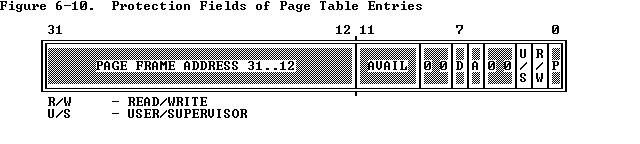

**up:** [Chapter 6 -- Protection](https://pdos.csail.mit.edu/6.828/2017/readings/i386/c06.htm)
**prev:** [6.3 Segment-Level Protection](https://pdos.csail.mit.edu/6.828/2017/readings/i386/s06_03.htm)
**next:** [6.5 Combining Page and Segment Protection](https://pdos.csail.mit.edu/6.828/2017/readings/i386/s06_05.htm)

------

# 6.4 Page-Level Protection

Two kinds of protection are related to pages:

与页面相关的两种保护：

1. Restriction of addressable domain.

   可寻址域的限制。

2. Type checking.

   类型检查。

### 6.4.1 Page-Table Entries Hold Protection Parameters

[Figure 6-10](https://pdos.csail.mit.edu/6.828/2017/readings/i386/s06_04.htm#fig6-10) highlights the fields of PDEs and PTEs that control access to pages.

图6-10突出显示了控制页面访问的PDE和PTE的字段。

#### 6.4.1.1 Restricting Addressable Domain

The concept of privilege for pages is implemented by assigning each page to one of two levels:

通过将每个页面分配给两个级别之一来实现页面特权的概念：

1. Supervisor level (U/S=0) -- for the operating system and other systems software and related data.

   特权级别（U/S = 0）-用于操作系统和其他系统软件以及相关数据。

2. User level (U/S=1) -- for applications procedures and data.

   用户级别（U/S = 1）-用于应用程序和数据

The current level (U or S) is related to CPL. If CPL is 0, 1, or 2, the processor is executing at supervisor level. If CPL is 3, the processor is executing at user level.

当前级别（U或S）与CPL有关。 如果CPL为0、1或2，则处理器将在特权级别执行。 如果CPL为3，则处理器正在用户级别执行。

When the processor is executing at supervisor level, all pages are addressable, but, when the processor is executing at user level, only pages that belong to the user level are addressable.

当处理器在特权级别执行时，所有页面都是可寻址的，但是，当处理器在用户级别执行时，仅属于用户级别的页面是可寻址的。

#### 6.4.1.2 Type Checking

At the level of page addressing, two types are defined:

在页面寻址级别，定义了两种类型：

1. Read-only access (R/W=0)	只读
2. Read/write access (R/W=1)  可读可写

When the processor is executing at supervisor level, all pages are both readable and writable. When the processor is executing at user level, only pages that belong to user level and are marked for read/write access are writable; pages that belong to supervisor level are neither readable nor writable from user level.

当处理器在特权级别执行时，所有页面都是可读和可写的。 

当处理器在用户级别执行时，只有属于用户级别并标记为可读写访问的页面才可写； 

属于特权级别的页面在用户级别上既不可读也不可写。

#### 6.4.2 Combining Protection of Both Levels of Page Tables

For any one page, the protection attributes of its page directory entry may differ from those of its page table entry. The 80386 computes the effective protection attributes for a page by examining the protection attributes in both the directory and the page table. Table 6-5 shows the effective protection provided by the possible combinations of protection attributes.

对于任何一页，其页面目录条目的保护属性可能与其页面表条目的保护属性不同。 80386通过检查目录和页表中的保护属性来计算页面的有效保护属性。 表6-5显示了由保护属性的可能组合提供的有效保护。

#### 6.4.3 Overrides to Page Protection

Certain accesses are checked as if they are privilege-level 0 references, even if CPL = 3:

即使CPL = 3，也会将某些访问视为特权级别0引用进行检查：

- LDT, GDT, TSS, IDT references.

- Access to inner stack during ring-crossing [CALL](https://pdos.csail.mit.edu/6.828/2017/readings/i386/CALL.htm)/[INT](https://pdos.csail.mit.edu/6.828/2017/readings/i386/INT.htm).

- 通过CALL / INT访问内部堆栈时。

------

**up:** [Chapter 6 -- Protection](https://pdos.csail.mit.edu/6.828/2017/readings/i386/c06.htm)
**prev:** [6.3 Segment-Level Protection](https://pdos.csail.mit.edu/6.828/2017/readings/i386/s06_03.htm)
**next:** [6.5 Combining Page and Segment Protection](https://pdos.csail.mit.edu/6.828/2017/readings/i386/s06_05.htm)